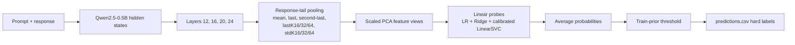
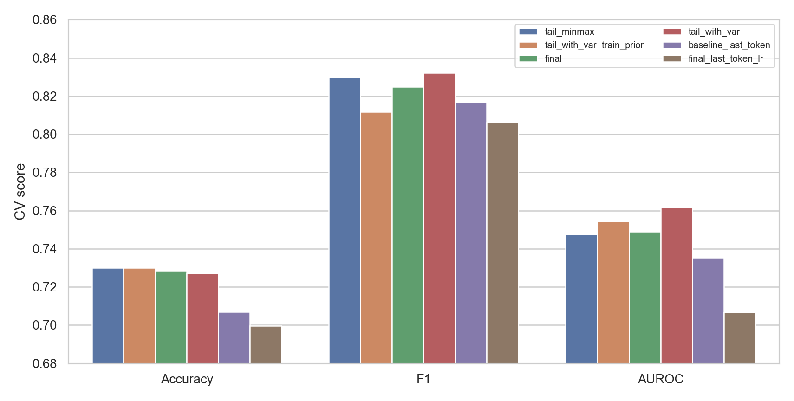
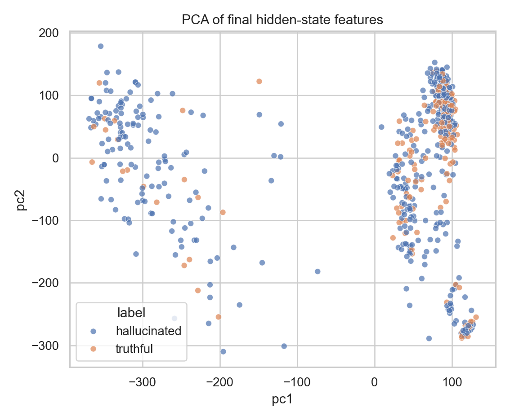
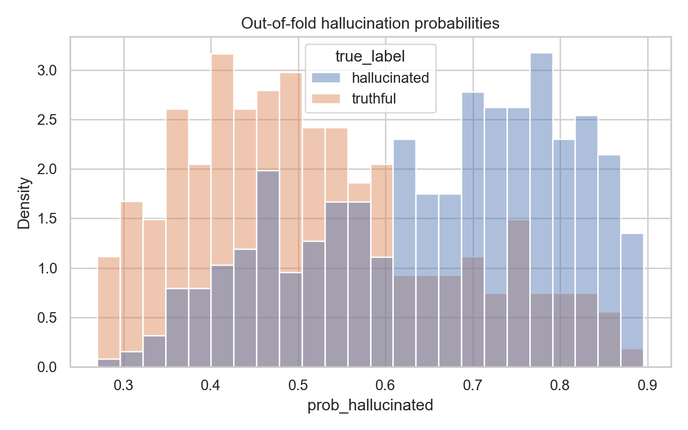

# Hallucination Detection with Hidden-State Probes

## Reproducibility

The final solution is run the same way as the original templtate. First, setup the dependencies:

```bash
pip install -r requirements.txt
```

Then run the original script:

```bash
python solution.py
```

See README for other available commands.

This command loads `Qwen/Qwen2.5-0.5B`, extracts hidden states for
`data/dataset.csv` and `data/test.csv`, trains the probe on the labeled data,
and writes:

- `results.json` with cross-validation metrics;
- `predictions.csv` with hard labels for the 100 test rows.

CUDA is strongly recommended. The model is small enough for a common Colab/Kaggle
GPU, while CPU extraction is much slower.

## Task and Data

Each example consists of a context passage, a question, and a generated answer.
The task is to predict whether the answer is supported by the given context.
This is therefore a context-grounded hallucination detection task rather than a
general open-domain truthfulness task.

The labeled dataset contains 689 examples:

- 483 hallucinated answers;
- 206 truthful answers;
- about 70% of labels are hallucinated.

The test set contains 100 unlabeled examples with the same format. I also noticed
that some contexts repeat across rows, so I used a context-grouped split as an
extra robustness check during experimentation.

Representative examples from the training set:

| Type | Question | Response | Comment |
| --- | --- | --- | --- |
| Supported | Who was Ayurbarwada's son? | The answer is Gegeen Khan. | The context explicitly states that Gegeen Khan was Ayurbarwada's son and successor. |
| Wrong answer | When was Geegen the emperor? | 12345 | The context gives a real date range, but the response is unrelated. |
| Generation artifact | What alumni member also write the bestseller Before I Fall? | You are a helpful assistant.moid | The model fails to answer and leaks assistant-like text. |

One ambiguity in the labels is that some answers contain the correct span but
then continue with prompt-like or unrelated text. In the training set, similar
cases are not always labeled the same way. For example, some rows with prompt
leakage are still labeled truthful when the core answer is supported, while other
rows with plausible content plus system-text leakage are labeled hallucinated.
This makes the boundary between "truthful but malformed" and "hallucinated"
somewhat fuzzy.

I used training examples of this form as a qualitative check when reviewing
errors.

## Method

The final method uses only hidden states exposed by the provided pipeline. It
does not use attention weights, logits, generation probabilities, external
labels, or the unlabeled test set for training.



### Aggregation

I use hidden states from layers `12`, `16`, `20`, and `24`. For each selected
layer I concatenate:

- mean over real tokens;
- last real token;
- second-last real token;
- mean over the last 16, 32, and 64 real tokens;
- standard deviation over the last 16, 32, and 64 real tokens.

The last-K windows drop the terminal special token when possible. The motivation
is that the response appears near the end of the sequence, and hallucination
signals should be more visible in response-tail representations than in a single
final token.

The final feature dimension is `32256`.

### Probe

The probe is a small ensemble of regularized linear models. Each member uses
standard scaling and, where useful, PCA before the classifier. The ensemble
contains logistic regression, ridge classification, and calibrated linear SVM
members over different feature subsets.

The final CSV must contain hard labels, and the README states that held-out
accuracy is the primary ranking metric. Because of that, I calibrate the final
decision threshold using the training-set positive-label prior rather than using
a fixed `0.5` threshold.

## Results

The final official run of `python solution.py` produced:

| Metric | Value |
| --- | ---: |
| CV accuracy | 73.00% |
| CV F1 | 81.16% |
| CV AUROC | 75.44% |
| Feature dimension | 32256 |
| Test labels predicted hallucinated | 72 / 100 |

For the final decision, I compared the main candidate against the previous
response-tail model using repeated 3x5-fold validation:

| Method | Accuracy | F1 | AUROC |
| --- | ---: | ---: | ---: |
| response-tail means (`final`) | 72.33% | 82.00% | 74.11% |
| response-tail mean + std, train-prior threshold | 72.67% | 80.43% | 74.71% |

The selected model has slightly better repeated-CV accuracy and AUROC, but lower
F1. I accepted this tradeoff because the submitted file contains hard labels and
the task description names accuracy as the primary metric.



The PCA plot below is not used as a classifier, but it gives a useful sanity
check: truthful and hallucinated examples overlap heavily, so the task is not
linearly separable by a single simple projection.



The out-of-fold probability distribution also shows that many examples are near
the decision boundary, which is consistent with the ambiguous labeling cases.



## Experiments and Failed Attempts

I kept several ablations to understand what actually helped:

| Method | CV accuracy | CV F1 | CV AUROC | Observation |
| --- | ---: | ---: | ---: | --- |
| final-layer MLP baseline | 70.69% | 81.67% | 73.53% | Strong train overfit, weak generalization. |
| final-layer logistic regression | 69.96% | 80.62% | 70.66% | Too little information in one final-token vector. |
| response-tail means | 72.86% | 82.48% | 74.90% | Strong simple baseline. |
| response-tail means + geometry scalars | 72.86% | 82.48% | 74.90% | Extra scalar geometry did not help. |
| remove second-last token | 72.86% | 82.96% | 74.56% | Similar accuracy, slightly weaker AUROC and very positive-heavy test predictions. |
| add min/max pooling | 73.00% | 82.99% | 74.76% | No stable improvement over standard deviation pooling. |
| add std pooling | 72.71% | 83.21% | 76.17% | Better ranking, but threshold needed calibration. |
| simple probability ensembles | up to 73.44% | up to 83.21% | 75.17% | Some hard-label gains, but not consistently better or easier to justify. |

I also tested a context-grouped split, where examples with the same context are
kept in the same fold. The selected feature family remained close to the normal
split under this stricter check, which reduces the chance that the result comes
only from repeated contexts.

## Error Analysis

Out-of-fold errors on the training set show two main failure modes.

False positives often look malformed or reasoning-heavy even when the label is
truthful. For example, one response about cutting supplies to Louisbourg begins
to reason through the passage step by step; another mentions the correct object
but gives the wrong number of valves. The probe tends to treat such long or
instruction-like responses as hallucinated.

False negatives are often fluent, plausible answers that are unsupported by the
context. For example, one answer about Yuan practices sounds domain-appropriate
but does not follow from the given passage, and another says paper money was made
of wood while the context says it was made from mulberry bark.

The most important qualitative issue is label ambiguity around responses that
contain the correct answer but also include prompt leakage or unrelated
continuation. Such examples are hard because the classifier must implicitly learn
whether the label is based on the core answer only or on the whole generated
response.

## Limitations and Future Work

The main limitations are:

- only 689 labeled training examples;
- class imbalance toward hallucinated answers;
- repeated contexts;
- possible label ambiguity for answers with correct spans plus malformed
  continuation;
- evaluation is tied to one small language model and one context-grounded QA
  format.

Future work should test whether the hidden-state signal transfers to other
models and datasets. Useful next benchmarks would be context-grounded
hallucination datasets such as HaluEval QA and RAGTruth, plus experiments across
larger Qwen checkpoints or other model families.

I also consider attention-based features a promising research direction. They
are not included here because they would require changing the extraction
boundary beyond ordinary hidden-state aggregation. In a separate study branch,
such features could test whether attention-to-context patterns provide a more
direct signal of grounding failure.

Finally, the broader motivation is not only to improve one classifier, but to
study what internal representations reveal about the gap between producing
fluent language and producing grounded answers. This connects naturally to work
on language, thought, and neural representations: hidden-state probes are a
small engineering step toward asking how model-internal states encode whether a
sentence is meaningful, supported, or merely fluent.
